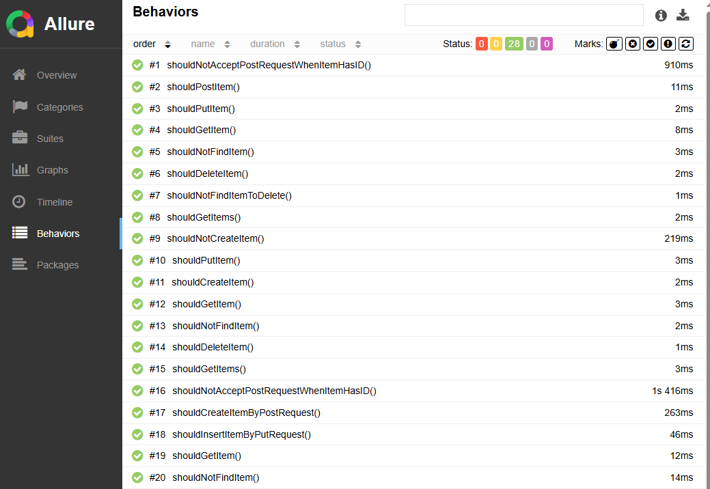

> This documentation is also available in an enhanced form at
> [Layered Architecture Template](https://kamilmazurek.pl/layered-architecture-template) page.

# Layered Architecture Template

This repository contains the implementation of a Spring Boot microservice template that adopts the classic Layered Architecture approach. Designed with simplicity and clarity in mind, it provides a solid foundation for building Java applications that are easy to understand, extend, and maintain. The template separates concerns across common layers such as controllers, services, and repositories, and delivers a cleanly structured REST API ready for real-world use.
Core benefits:
* **Simplicity and Familiarity**: Widely adopted, this pattern is easy to understand and implement, especially for traditional enterprise teams.
* **Separation of Responsibilities**: The architecture organizes code into layers like controller, service, and repository, each handling its role clearly.
* **Maintainability**: Encapsulation of responsibilities within layers makes the application easier to debug, extend, and refactor over time.
* **Testability**: With clearly defined boundaries between layers, unit and integration testing become more straightforward and effective.
* **Scalability for Common Use Cases**: Ideal for CRUD apps or moderate logic, where layers support growth without added complexity

It was designed to be minimalistic, organized, and flexible to change.

## Quickstart

You can quickly get started with the Layered Architecture Template by following these steps:
1. Confirm that a JDK is installed to build and run the app. Temurin, based on OpenJDK, is available at [adoptium.net](https://adoptium.net/).
2. Obtain the source code by cloning the repository using Git, or downloading it as a ZIP archive.
   If you downloaded the ZIP file, extract it and navigate to the `layered-architecture-template` directory.
3. Launch the application with the development profile to preload sample data:
    ```shell
    mvnw spring-boot:run -Pdev
    ```
4. Check if the app is running by sending a GET request to the following URL. You can also paste it directly into your browser:
    ```console
    http://localhost:8080/items/1
    ```
   You should see a response containing the following item:
    ```json
    [
      {
        "id": 1,
        "name":"Item A"
      }
    ]
    ``` 
5. Customize the code as needed, then rebuild and relaunch the project to see your changes in action 🚀.

## Table of contents
* [Motivation](#motivation)
* [Architecture Overview](#architecture-overview)
* [When to Use Layered Architecture](#when-to-use-layered-architecture)
* [Technology Stack](#technology-stack)
* [How It Works](#how-it-works)
* [Build and Deployment](#build-and-deployment)
* [REST API Overview](#rest-api-overview)
* [Swagger and OpenAPI Endpoints](#swagger-and-openapi-endpoints)
* [Production-ready Features](#production-ready-features)
* [Testing Strategy](#testing-strategy)
* [Additional Resources](#additional-resources)
* [Author](#author)
* [Disclaimer](#disclaimer)

## Motivation

Starting new projects often involves repetitive setup work to establish a solid codebase.
This template aims to streamline that process by providing a clear, Layered Architecture based microservice example that can be reused and adapted quickly.
While Maven Archetypes offer automation, the effort required to maintain a flexible archetype felt too demanding.
Instead, this template balances simplicity and practicality to help developers get started faster.

## Architecture Overview

Layered Architecture is a classic software design pattern that organizes code into distinct layers, each with a specific responsibility.
This separation helps manage complexity, improve maintainability, and promote clear boundaries between different parts of an application.

The classic layers are:
* **Presentation Layer**: Responsible for handling user interactions and input/output operations.
* **Business Layer**: Contains the core application logic and rules.
* **Persistence Layer**: Manages data storage and retrieval from databases.
* **Database**: The actual data storage infrastructure where data physically resides.

In modern REST-based applications built with Spring Boot, these map naturally to:
* **API Layer**: Exposes REST endpoints and handles HTTP requests/responses (equivalent to Presentation).
* **Service Layer**: Implements business logic and orchestrates operations (equivalent to Business Logic).
* **Repository Layer**: Interfaces with the database, handling CRUD operations (equivalent to Persistence).
* **Database Layer**: Stores the application data.

Each layer communicates only with the one directly below it, ensuring clear boundaries and straightforward data flow.
This diagram illustrates the REST-based layer concept implemented in this project, while also showing the classic counterparts:


<p align="center">
<i>Layered Architecture Template concept diagram</i>
</p>

Layered Architecture remains a popular pattern for enterprise applications thanks to its clear separation of concerns and ease of understanding.
Spring Boot's convention-over-configuration approach and built-in support for RESTful services, data access, and testing tools make it particularly well-suited for implementing this pattern.
Together, they provide a solid foundation that helps teams quickly build and maintain scalable applications without unnecessary complexity.

Consequently, this repository provides a template implementation of a microservice following the Layered Architecture pattern, developed in Java with Spring Boot. It consists of:
* **API Layer**
    * REST controllers handling HTTP requests
* **Service Layer**
    * Business logic and service operations
* **Repository Layer**
    * Data access and persistence interface
* **Supporting Components**
    * Swagger for API documentation
    * OpenAPI specifications
    * Spring Boot Actuator for monitoring and management
* **Database Layer**
    * In-memory H2 database for development and testing

Please keep in mind this project serves as a basic template, providing core support for HTTP request handling and database interactions.
It's flexible by design, allowing you to add features or integrations as your requirements evolve.

## When to Use Layered Architecture

Layered Architecture organizes your application into distinct layers, each with a specific responsibility such as presentation, business logic, and data access.
This clear separation simplifies development, improves maintainability, and helps enforce separation of concerns across your codebase.

This approach is particularly effective for projects with well-defined and stable requirements, where a straightforward division between layers can improve team collaboration and speed up delivery.
It works well for applications that primarily follow a request-response model, such as typical REST APIs, and where concerns like UI, service logic, and database access can be cleanly separated.
For smaller or less complex projects, Layered Architecture offers a familiar and easy-to-understand structure that helps avoid unnecessary complexity.
It also suits teams that prefer conventional architectural patterns or need quick onboarding of new developers.

However, for systems requiring high flexibility or integration with multiple external interfaces, more decoupled architectures like Hexagonal or Event-Driven might provide better adaptability.
In such cases, you might be interested in the [Hexagonal Architecture Template](https://kamilmazurek.pl/hexagonal-architecture-template).

Layered Architecture remains a solid choice when the focus is on clear organization, testability, and incremental development.
Ultimately, use Layered Architecture when your project benefits from a clear hierarchical structure that promotes simplicity, maintainability, and team alignment, especially when the application is expected to evolve steadily within a defined scope.

## Technology Stack

Layered Architecture Template is built using Java and Spring Boot, which naturally support modular design and clear separation between layers.
It uses the in-memory H2 database for quick prototyping and testing, but thanks to Spring Data, switching to another database later is simple and straightforward.

OpenAPI is used to clearly define the RESTful APIs exposed by the API layer, helping maintain a clean separation between layers and simplifying client generation.
This aligns well with the layered architecture's goal of separating presentation from business logic.

Testing is an integral part of the stack, with unit tests focusing on individual service and repository layers, and integration tests verifying end-to-end flow across layers.
Maven Surefire and Failsafe plugins ensure smooth test execution during builds.

Here’s an overview of the technology stack:
- **Language & Framework**
    - **Java 21**: Modern Java version powering the core application logic.
    - **Spring Boot**: Simplifies building modular, RESTful Java applications.
- **API & Data**
    - **OpenAPI**: Defines clear REST API specs and supports client generation.
    - **ModelMapper**: Helps map data between layers smoothly.
    - **H2 database**: Lightweight in-memory database for development and testing.
- **Testing**
    - **JUnit**: Core framework for unit testing Java code.
    - **REST Assured**: Integration testing for REST APIs.
    - **Mockito**: Mocks dependencies to isolate components during tests.
    - **Allure Report**: Generates detailed and user-friendly test reports.
- **Build & Deployment**
    - **Apache Maven**: Manages builds and dependencies efficiently.
    - **Docker**: Packages the app into containers for consistent deployment.

This stack was picked to support the layered design, focusing on clear separation, ease of testing, and flexibility to grow with the application's needs.
It provides a solid foundation for building maintainable, modular, and production-ready microservices.

## How It Works

This implementation follows Layered Architecture principles by organizing the application into distinct layers with clear responsibilities. 
The key layers here are the presentation layer (controller), service layer (business logic), and data access layer (repository).
To illustrate how these layers interact, let's walk through a typical Read use case, starting with a `GET` request handled by the controller.

The `ItemsController` serves as the entry point for incoming HTTP requests. It receives the GET request, delegates processing to the service layer, and returns the appropriate HTTP response:

```java
@RestController
@AllArgsConstructor
public class ItemsController implements ItemsApi {

  private final ItemsService service;

  @Override
  public ResponseEntity<ItemDTO> getItem(Long id) {
    return service.getItem(id).map(ResponseEntity::ok).orElse(ResponseEntity.notFound().build());
  }
    
  (...)

}
```

The `ItemsService` contains the core business logic. It processes requests from the controller, applies any necessary rules or transformations, and interacts with the data access layer to fetch or modify data.
This separation keeps business rules centralized and reusable. It's also the place where more complex domain behavior or custom logic can be introduced as needed.
Since this example only covers a simple read operation, the service currently just retrieves data from the repository, maps between the entity, domain object, and DTO, and returns it to the controller.

```java
@Service
@AllArgsConstructor
public class ItemsService {

    private final ItemsRepository repository;

    private final ModelMapper mapper;

    (...)

    public Optional<ItemDTO> getItem(Long id) {
        return repository.findById(id).map(this::toDomainObject).map(this::toDTO);
    }
    
    (...)
    
}
```

Data persistence and retrieval are handled by the `ItemsRepository`, which communicates with the database using Spring Data's `JpaRepository`.
This layer abstracts database operations and keeps the service layer decoupled from storage-specific implementation details.
For development and testing, the application uses an H2 in-memory database, which simplifies setup and allows for fast, isolated tests without the need for a full database installation.

```java
@Repository
public interface ItemsRepository extends JpaRepository<ItemEntity, Long> {

    @Query("select max(item.id) from ItemEntity item")
    Long findMaxID();

}
```

Once the data is retrieved, it flows back through the service to the controller, which formats it into an HTTP response sent to the client.
This clear layering helps maintain a strong separation of concerns, making the application easier to develop, test, and maintain.

By adhering to these layered principles, the application remains organized and scalable, allowing effective work on individual layers without tightly coupling components.
This results in cleaner code and a more maintainable system over time.

## Build and Deployment

This template is built with Spring Boot, which works well with the layered approach by clearly separating presentation, service, and data access responsibilities.
The build process is managed using Apache Maven, which handles dependency management, compilation, testing, and packaging.

To perform a full build, including compiling source code, running unit and integration tests, and installing the jar into your local Maven repo, run:
```shell
mvnw clean install
```

To run the application locally during development, you can use the following Maven command, which starts the Spring Boot application without requiring a separate packaging step:
```shell
mvnw spring-boot:run
```

Alternatively, you can package the application into an executable jar file and run it directly using the Java command. First, build the package with:
```shell
mvnw clean package
```
Then, start the application by executing the jar:
```shell
java -jar target/layered-architecture-template-1.0.0-SNAPSHOT.jar
```

The project includes a Dockerfile to simplify containerized deployment. To build a Docker image and run the application inside a container, use the following commands:
```shell
mvnw clean package
docker build -t template/layered-architecture-template .
docker run -p 8080:8080 template/layered-architecture-template
```

For easier development and testing, the project provides a special profile that preloads sample data. You can launch the application with this profile enabled by running:
```shell
mvnw spring-boot:run -Pdev
```

This setup offers a simple and flexible way to build, run, and deploy the application in various environments. Whether you’re working locally, running tests, or preparing for production, these commands cover the essential steps for an efficient development workflow.


## REST API Overview

> **Note:** You can test all the endpoints below using Swagger UI, available at  http://localhost:8080/swagger-ui/index.html.

The API is defined in [api.yaml](src/main/resources/api.yaml) and is intentionally kept simple, as this project is designed to serve as a  template.
It supports the standard HTTP methods: `POST`, `GET`, `PUT`, and `DELETE`, providing basic CRUD operations for managing items, including create, read, update (or more precisely, upsert), and delete.
Each request is routed through the application’s layered structure, allowing clear separation between the controller, service, and data access layers.
* `POST /items`: Creates a new item.
* `GET /items`: Retrieves all items.
* `GET /items/{itemId}`: Retrieves a single item by its ID.
* `PUT /items/{itemId}`: Creates or updates an item with the specified ID.
* `DELETE /items/{itemId}`: Deletes an item by its ID.

By default, the application runs on port `8080`. Once running, items can be retrieved by sending a `GET` request to the following endpoint:
```console
http://localhost:8080/items
```

The response will contain all items currently stored in the database. If no items are present, an empty array is returned:
```json
[]
```

New items can be added to the database using the `POST` method. For example, the following curl command can be used on Linux to create an item named "Item A":
```console
curl -i -X POST http://localhost:8080/items \
  -H "Content-Type: application/json" \
  -d '{"name":"Item A"}'
```

Items can also be added or updated using the `PUT` method. For example, the following curl command adds or updates an item with the ID `1`:
```console
curl -i -X PUT http://localhost:8080/items/1 \
  -H "Content-Type: application/json" \
  -d '{"id":1, "name":"Item A"}'
```

After adding the item, you can verify it by retrieving the list of items. A `GET` request  to `/items` should now return the newly added entry:
```console
http://localhost:8080/items
```
```json
[
  {
    "id": 1,
    "name":"Item A"
  }
]
```  

You can also fetch a specific item by its ID using the `/items/{id}` endpoint. For example, sending `GET /items/1` request:
```console
http://localhost:8080/items/1
```
```json
{
  "id": 1,
  "name":"Item A"
}
```

When the application is started with the `dev` profile enabled, it automatically loads a set of sample data into the database to facilitate easier development and testing.
As a result, sending a `GET` request to the `/items` endpoint will return a predefined list of items like the following:
```console
http://localhost:8080/items
```
```json
[
  {
    "id":1,
    "name":"Item A"
  },
  {
    "id":2,
    "name":"Item B"
  },
  {
    "id":3,
    "name":"Item C"
  }
]
```

Items can be removed from the database using the `DELETE` method.
For instance, to delete the item with ID `1`, you can execute the following curl command on a Linux terminal.
This will send a request to the server to remove the specified item:
```console
curl -i -X DELETE http://localhost:8080/items/1
```

As another option, you can perform all these operations such as GET, POST, PUT and DELETE through the Swagger user interface.
Simply navigate to http://localhost:8080/swagger-ui/index.html to explore and interact with the API endpoints in an easy and interactive way.

The REST API works well with the layered architecture by offering a clear and consistent way to interact with the application's core functionality.
This setup improves modularity and flexibility, letting each layer evolve independently while keeping communication smooth through well-defined API endpoints.

## Swagger and OpenAPI Endpoints

The application includes Swagger UI and an OpenAPI `/api-docs` endpoint that provide interactive API documentation.
These can be accessed locally at the following URLs:
* http://localhost:8080/swagger-ui/index.html
* http://localhost:8080/api-docs

Swagger UI offers a visual and interactive way to browse the API endpoints exposed by the application’s presentation layer (more precisely, the controller in this template).
It simplifies sending `HTTP` requests such as `GET`, `POST`, `PUT`, and `DELETE`, which correspond to CRUD operations handled through the underlying service and data layers.
This makes Swagger a convenient tool for manual testing, debugging, and exploring how the API interacts with the different layers of the application.
For example, you can easily check what data is returned for a `GET /items` request:


<p align="center">
<i>Sample Swagger UI view. For more details about Swagger, visit </i>
<a href="https://swagger.io"><i>https://swagger.io</i></a>
</p>

The OpenAPI `/api-docs` endpoint provides a machine-readable JSON specification of the API. This standardized format allows easy integration with various development tools, documentation generators, and client code generators, helping to maintain clear contracts between layers and teams. Sharing this specification fosters better collaboration and ensures that the API remains consistent with the layered architecture principles guiding the project.

These tools help reinforce the separation of concerns by clearly exposing the API endpoints managed by the presentation layer while hiding the complexities of the underlying service and data layers.
By maintaining this clear contract through Swagger and OpenAPI, you ensure that each layer can evolve independently without breaking the overall system architecture.


## Production-ready Features

The application uses Spring Boot Actuator, a library that adds production-ready features to Spring Boot applications. It provides capabilities like monitoring and health checks, which are enabled through the included configuration.
These features allow you to observe the health and status of the application across its layers, from the presentation layer down to the data layer, helping ensure that each part of the layered architecture is functioning properly.

Two important actuator endpoints configured in this template are:
* `/actuator` which lists all exposed actuator endpoints: http://localhost:8080/actuator/
* `/actuator/health` which shows the current health status of the application: http://localhost:8080/actuator/health

You can find the list of available actuator endpoints by accessing the `/actuator` endpoint in your running application.
This list can be customized by modifying the `management.endpoints.web.exposure.include` property in [application.yaml](src/main/resources/application.yaml).

For example, to enable the `beans` endpoint, add it to the `management.endpoints.web.exposure.include` list like this:
```yaml
management:
  endpoints:
    web:
      exposure:
        include: health, beans
```

For more details, visit the Spring Boot Actuator documentation: https://docs.spring.io/spring-boot/reference/actuator/endpoints.html

You can verify the health status of the application by sending a request to the `/actuator/health` endpoint.
The response will include the current state of the application, such as:
```console
http://localhost:8080/actuator/health
```
```json
{
  "status": "UP"
}
```

By default, the application provides only basic health status information for security reasons.
If more detailed information is needed, such as disk space usage or database connectivity, this can be enabled by updating the [application.yaml](src/main/resources/application.yaml) configuration file as shown below:
```yaml
management:
  endpoint:
    health:
      show-details: "always"
```

Applying this change results in more detailed information at the `/actuator/health` endpoint.
It also enables additional endpoints like  `/actuator/health/db`, which provide details about the database:
```console
http://localhost:8080/actuator/health/db
```
```json
{
  "status": "UP",
  "details": {
    "database": "H2",
    "validationQuery": "isValid()"
  }
}
```

These features help you monitor and maintain the application effectively, providing valuable insights into its health and performance across all layers of the architecture.
Proper use of actuator endpoints can improve reliability and simplify troubleshooting in both development and production environments.

**Important:** In production environments, actuator endpoints should be secured to prevent unauthorized access. It is recommended to restrict access using authentication and authorization mechanisms. Be cautious when enabling detailed health information or sensitive endpoints.

## Testing Strategy

This project includes a structured testing setup that combines unit tests and integration tests, helping ensure both individual components and their interactions behave as expected.
Test execution is handled using Maven’s Surefire and Failsafe plugins, which are configured out of the box.

Testing is built around well-established tools and libraries:
* JUnit: Used for writing test cases and defining assertions.
* Mockito: Helps simulate dependencies in unit testing.
* REST Assured: Simplifies testing REST endpoints during integration testing.

This layered approach to testing aligns with the project's architecture and encourages maintainable, focused tests at every level.

There are two main categories of tests included in this project:
* Unit tests (`*Test.java`), which verify individual classes or methods in isolation. These run using the Maven Surefire Plugin.
* Integration tests (`*IntegrationTest.java`), used to verify how components interact. These tests run with the Maven Failsafe Plugin.

Here is a simple example of a JUnit unit test, `ItemsControllerTest`, which tests the `ItemsController` behavior.
It uses Mockito to mock the behavior of `ItemsService`, then requests an item using the controller and validates the response:
```java
class ItemsControllerTest {

    @Test
    void shouldGetItem() {
        //given item
        var item = new ItemDTO().id(1L).name("Item A");

        //and service
        var service = mock(ItemsService.class);
        when(service.getItem(1L)).thenReturn(Optional.of(item));

        //and controller
        var controller = new ItemsController(service);

        //when item is requested
        var response = controller.getItem(1L);

        //then response containing expected item is returned
        assertEquals(item, response.getBody());

        //and OK status is returned
        assertEquals(OK, response.getStatusCode());

        //and service was involved in retrieving the data
        verify(service).getItem(1L);
    }
    
    (...)
    
}
```
Following that, here's an example of an integration test, `ItemsControllerIntegrationTest`, which verifies how multiple components work together to handle requests and responses.
This is also a JUnit test, but this one runs with `@SpringBootTest`, so it starts an H2 database and Spring context, including controllers, database connections and more. It uses REST-assured to perform requests and validate responses, testing the actual behavior across multiple layers:
```java
class ItemsControllerIntegrationTest extends AbstractIntegrationTest {

    private final ObjectWriter objectWriter = new ObjectMapper().writer();

    @Test
    void shouldGetItem() throws JsonProcessingException {
        when()
                .get("/items/1")
                .then()
                .statusCode(200)
                .assertThat()
                .body(equalTo(objectWriter.writeValueAsString(new ItemDTO().id(1L).name("Item A"))));
    }
    
    (...)
    
}
```

Unit tests, which verify individual components in isolation, can be executed using the Maven Surefire Plugin by running the following command:
```console
mvnw clean test
```

Integration tests, which validate how multiple components work together within the application, can be run using the Maven Failsafe Plugin:
```console
mvnw clean integration-test
```
Note that this command also executes unit tests as part of the build lifecycle.

Both unit and integration tests are executed automatically during the standard Maven build process:
```console
mvnw clean install
```
This helps ensure that the application behaves correctly across individual components as well as across layers, from the service logic to the data access, before packaging or deployment.

In addition, the project is configured to work with Allure Report, which provides a visual representation of test execution results.
You can generate and open the report in your browser by running the following commands:
```console
mvnw clean integration-test
mvnw allure:serve
```
The report provides a clear overview of test results, including which tests passed or failed, how long they took to run, and the overall coverage.
A sample view of the generated report is shown below:


<p align="center">
<i>Sample Allure Report. For more information, visit</i>
<a href="https://allurereport.org/"><i>https://allurereport.org/</i></a>
</p>

This testing setup supports the layered architecture by ensuring that each level, from isolated service logic to fully integrated REST interactions, is thoroughly verified.
It helps maintain confidence that every layer of the application behaves reliably both on its own and in coordination with others.

## Additional resources
* [Layered Architecture, Baeldung](https://www.baeldung.com/cs/layered-architecture)
* [Multitier architecture, Wikipedia](https://en.wikipedia.org/wiki/Multitier_architecture)
* [Repository Pattern with Layered Architecture, Medium](https://medium.com/@leadcoder/repository-pattern-with-layered-architecture-35f7b9182ebf)
* [Layered Architecture Template on LibHunt](https://www.libhunt.com/r/layered-architecture-template)

## Author
This project was created by [Kamil Mazurek](https://kamilmazurek.pl), a Software Engineer based in Warsaw, Poland.
You can also find me on my [LinkedIn profile](https://www.linkedin.com/in/kamil-mazurek). Thanks for visiting 🙂

## Disclaimer

THIS SOFTWARE AND ANY ACCOMPANYING DOCUMENTATION (INCLUDING, BUT NOT LIMITED TO, THE README.MD FILE) ARE PROVIDED
FOR EDUCATIONAL PURPOSES ONLY.

THE SOFTWARE AND DOCUMENTATION ARE PROVIDED "AS IS", WITHOUT WARRANTY OF ANY KIND, EXPRESS OR IMPLIED,
INCLUDING BUT NOT LIMITED TO THE WARRANTIES OF MERCHANTABILITY, FITNESS FOR A PARTICULAR PURPOSE AND NONINFRINGEMENT.
IN NO EVENT SHALL THE AUTHORS OR COPYRIGHT HOLDERS BE LIABLE FOR ANY CLAIM, DAMAGES OR OTHER LIABILITY,
WHETHER IN AN ACTION OF CONTRACT, TORT OR OTHERWISE, ARISING FROM, OUT OF OR IN CONNECTION WITH THE SOFTWARE,
THE DOCUMENTATION, OR THE USE OR OTHER DEALINGS IN THE SOFTWARE OR DOCUMENTATION.

Spring Boot is a trademark of Broadcom Inc. and/or its subsidiaries.
Oracle, Java, MySQL, and NetSuite are registered trademarks of Oracle and/or its affiliates. Other names may be trademarks of their respective owners.